# Modelagem de banco de dados relacional: modelagem lógica e física

Identificando os tipos de modelagem de banco de dados; conhecendo as modelagens lógica e física; utilizando o Power Architect; criando tabelas, colunas e representações de cardinalidade no modelo físico; produzindo a representação das chaves primária e estrangeira; e desenvolvendo o processo de modelagem.

1. [Tipos de modelagem](#1-tipos-de-modelagem)
2. [Modelagem lógica](#2-modelagem-lógica)
3. [Modelagem física](#3-modelagem-física)
4. [Tipos de dados, tabelas e colunas](#4-tipos-de-dados-tabelas-e-colunas)
5. [Concluindo o projeto](#5-concluindo-o-projeto)

Saiba mais sobre o curso [aqui](https://cursos.alura.com.br/course/modelagem-banco-dados-relacional-modelagem-logica-fisica) ou acompanhe minhas anotações abaixo. ⬇️

## 1. Tipos de modelagem

### **Modelo lógico x Modelo físico**

O `modelo lógico` mostra as entidades como tabelas, atributos como colunas dessa tabela e os relacionamentos como ligações entre as tabelas através das chaves primárias e componentes de cada uma.

> Pense em um MDL como um projeto: Ele representa as definições e características dos elementos de dados que permanecem os mesmos ao longo das mudanças tecnológicas. - [Oscar Kenjiro N. Asakura](https://www.linkedin.com/pulse/o-que-é-um-modelo-de-dados-lógico-oscar-kenjiro-n-asakura)

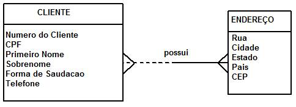

O `modelo físico` é como o sistema será implementado para o banco de dados. Uma expansão dos modelos conceitual e lógico. Uma sequência de comandos em SQL que cria a estrutura do projeto.

> MFDs devem refletir os padrões de nomenclatura de banco de dados da organização. Um MFD deve também indicar os tipos de dados das colunas, tais como "integer" e "char()". - [Arilo, Devmedia](https://www.devmedia.com.br/modelagem-de-dados-tutorial/20398)

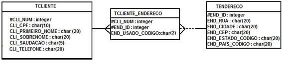

### **Características do MLD e MFD**

> O `Modelo Lógico de Dados` (MLD) tem foco em descrever os conceitos de domínio e dos envolvidos em um banco de dados. Raramente é utilizado em projetos ágeis, ao contrário do Modelo Físico de Dados (MFD).
>
> O `Modelo Físico de Dados` (MFD) é utilizado para apresentar detalhes, como as tabelas associativas, por indicar os tipos de dados de cada campo e as chaves que serão necessárias para traçar os relacionamentos.

***Passos para realizar a modelagem de dados:***

1. Entrevista com o usuário
2. Criação do mini-mundo
3. Modelo conceitual
4. Modelo lógico
5. Modelo físico

## 2. Modelagem lógica

### **Classificando os itens no modelo lógico**

Enquanto no modelo conceitual são utilizados os termos `entidade`, `atributos` e `relaciomentos`. No modelo lógico, esses termos são tratados como `relação/tabela`, `campos`, `ligações`. Isso porque a representação das informações começa a tomar outra forma.

***Relembrando o modelo conceitual:***

    O modelo conceitual é uma representação gráfica da descrição elaborada durante a entrevista com o usuário.
    Termos como: cliente, livros, editora, estoque e pedidos se tornam entidades (sejam elas fortes ou fracas).
    Os dados que se encaixam no escopo dessas entidades são tratados como atributos.

    O cliente, por exemplo, possui informações pessoais que o identifica no ato do cadastro e da compra, como:
    nome, telefone, e-mail e endereço (sejam eles simples, multivalorados ou compostos).
    A partir dessa e de outras informações criam-se os relacionamentos das entidades.

    Ao comprar um livro, o cliente disponibiliza seus dados para que sejam registrados no pedido.
    Então tem como saber quem comprou, que livro foi vendido, em que data e quanto foi pago.
    Ao passo que o livro possui relacionamento com a editora que o disponibiliza e com o estoque do clube.

`Importante saber:`

- Chaves primárias são identificadores únicos de relações fortes
- Chaves estrangeiras são identificadores parciais de relações fracas (e são somados às chaves primárias)

Isso quer dizer que o cliente existe independentemente se ele realiza ou não uma compra (faz um pedido), mas o pedido só existe se o cliente realizar uma compra, emitir uma nota e o livro sofrer baixa no estoque.

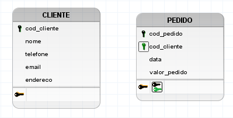

No `brModelo` a chave primária é visualizada na cor preta, enquanto a chave estrangeira é vista na cor verde.

### **Para saber mais: atributos do relacionamento**

A aula 6 do capítulo 2 do curso, reforça o entendimento de `cardinalidade` no relacionamento de atributos. Diz que atributos diretamente ligados a um relacionamento precisam ser movidos para uma das entidades, tornando-se atributos migrados.

📝 Leia mais sobre [Atributos do Relacionamento](Para%20saber%20mais/Aula%202%20-%20Atividade%206%20Para%20saber%20mais_%20atributos%20do%20relacionamento.pdf).

### **Modelo de dados lógico do Clube do Livro:**

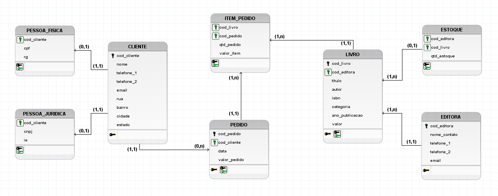

O modelo lógico elaborado no curso pode ser acessado baixando o arquivo [modelagem_logica](modelagem_logica.brM3).

## 3. Modelagem física

O `modelo físico` utiliza tabelas reais na sua modelagem, trabalhando com propriedades e siglas para identificar o objeto e suas características. Enquanto nos modelos anteriores, o nome de uma das entidades/relações é **"Cliente/CLIENTE"**, na modelagem física a tabela passa a ser nomeada como **"Tb_Cliente"**.

***Relembrando o modelo lógico:***

    O modelo lógico trabalha com os dados de forma mais organizada.
    Pois utiliza tabelas nas representações das entidades (ou relações).
    Os campos principais são identificados com suas respectivas chaves.
    Com diferenças na cor das chaves para representar as relações fortes e fracas.
    Já as ligações tem sua cardinalidade representada de maneira mais significativa.

    Além disso, o modelo lógico pode ser convertido em modelo físico.
    Sem a necessidade de realizar uma nova modelagem.
    Adicionando as características dos campos e demais definições com SQL.
    É mais um passo importante rumo a formação do banco de dados.

***Para criar uma tabela no Power Architect, deve-se:***

- Clicar em New Table (tecla T) para selecionar a ferramenta
- Clicar dentro da área na tela para desenhar a tabela
- Que abre uma caixa para criar o nome lógico (Ex: CLIENTE)
- O nome físico (que será implementada no banco de dados, ex: Tb_Cliente)
- E uma chave primária (em inglês: primary-key ou pk, ex: Tb_Cliente_pk)

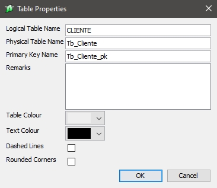

No modelo físico, os antes denominados atributos e campos, agora são chamados de `colunas`. As colunas de uma tabela recebem, na sua construção, um `tipo` que irá determinar as características dos dados inseridos nela. Esses dados podem ser texto, numérico (inteiro, decimal), data e hora, booleano, binário e outros.

***Para criar uma coluna no Power Architect, deve-se:***

- Clicar em New Column (tecla C) para selecionar a ferramenta
- Na janela que abrir, dar o nome lógico e físico (Ex: cod_cliente)
- Marcar a caixa de chave-primária, se for o caso
- Dizer o tipo de dado que a coluna vai receber (char, varchar, integer, float, boolean, date, time...)
- Habilitar ou não que a coluna receba nulos (no caso de chaves-primárias, não permitir nulos)
- Habilitar ou não o auto incremento (função utilizada para códigos de cadastro em sequência, sem repetição)

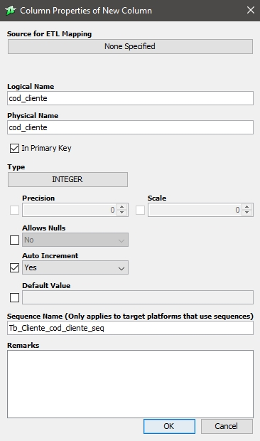

***Softwares para criação do modelo físico:***

- [SQL Power Architect](https://bestofbi.com/architect-download/)
- [MySQL Workbench](https://www.mysql.com/products/workbench/)
- [DB Designer](https://www.dbdesigner.net/)
- [Astah Professional](https://astah.net/downloads/)

## 4. Tipos de dados, tabelas e colunas

### **Domínio**

> O domínio designa o tipo de dados que será aceito na coluna.

- `CHAR` strings fixas
- `TEXT` strings variáveis
- `VARCHAR` alfanumérico variável (permite letras e números)
- `INTEGER` números inteiros
- `DECIMAL` números decimais
- `FLOAT` inteiro e decimal (utilizado para preços)
- `BOOLEAN` verdadeiro ou falso
- `DATE` valores de data
- `TIME` valores de hora
- `TIMESTAMP` valores de data e hora

### **Preenchendo as tabelas**

<spam style="display: flex">
    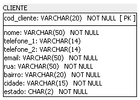
    

        A <u>tabela cliente</u> possui dados que receberão apenas o tipo varchar, isso porque os dados são essencialmente alfanuméricos. Inclusive o telefone, que pode receber símbolos como hífen e parênteses.
    

</spam>

<spam style="display: flex">
    

        As tabelas <u>item_pedido</u> e <u>pedido</u> possuem dados em varchar, inteiro e decimal. Isso porque elas possuem chave primária (para a tabela pedido). A quantidade de item do pedido recebe um valor inteiro porque não existe "meio" item. E recebem o tipo decimal no valor do item e no valor do pedido.
    

    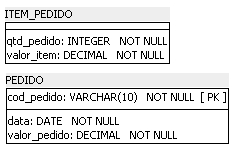
</spam>

<spam style="display: flex">
    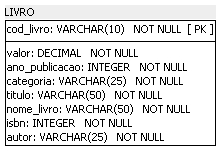
    

        A <u>tabela livro</u> recebe varchar de 10, 25 e 50 caracteres em algumas colunas, inteiros para o ano de publicação do livro e no código ISBN, e decimal para o valor do livro. Sem possibilidade de valores nulos no registro.
    

</spam>

<spam style="display: flex">
    

        A <u>tabela editora</u>, por ser uma entidade forte, recebe sua chave primária. Nome de contato e e-mail com varchar de 50 caracteres. E, diferente da tabela cliente, ao menos um número de telefone precisa ser registrado, no tipo varchar com 14 caracteres cada.
    

    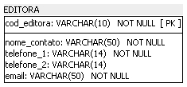
</spam>

<spam style="display: flex">
    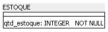
    

        A <u>tabela estoque</u> recebe, inicialmente, apenas a quantidade de estoque. Quando forem feitas as ligações, ela passará a possuir duas chaves estrangeiras: os códigos do livro e da editora.
    

</spam>

<spam style="display: flex">
    

        As tabelas <u>pessoa física</u> e <u>pessoa jurídica</u> levam o mesmo princípio do estoque. Receberão uma chave primária da tabela cliente. E possuem colunas em varchar com 15 e 20 caracteres, respectivamente.
    

    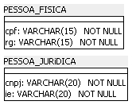
</spam>

## 5. Concluindo o projeto

Para realizar os relacionamentos, ou seja, as ligações entre as tabelas no modelo físico, no software Power Architect, basta escolher uma das opções disponíveis na ferramenta para inserção dos relacionamentos. As opções diferem no sentido de identificar ou não a relação. No caso de chaves estrangeiras diretas, não é necessário identificar. Já no caso de chaves estrangeiras parciais, é necessário.

Visualmente, a diferença é simples:

- Identificada: `PFK` primary foreign key
- Não identificada: `FK` foreign key

***Em outras palavras:***

> O `relacionamento identificador` é aquele na qual uma ocorrência da entidade fraca, precisa estar associada a exatamente uma ocorrência da entidade forte e não pode existir sem ela. Nesse caso, esse relacionamento é utilizado para representar uma chave primária estrangeira.
> 
> Já no `relacionamento não identificador`, cada ocorrência da entidade fraca pode ser identificada sem a necessidade de saber a qual ocorrência da entidade forte está associada. É utilizado para representar apenas chaves estrangeiras.

### **Representando a cardinalidade**

No modelo físico, a cardinalidade é representada por sinais, semelhantes a um pé de galinha no caso de relacionamento `N`. Representado por um traço no 1 e um círculo no 0. após concluir os relacionamentos, o modelo físico fica pronto para ser implementado no banco de dados.

`Importante saber:`  
A cardinalidade é representada na extremidade oposta à tabela.

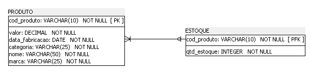

Isso significa que mesmo que a tabela produto esteja à esquerda, sua cardinalidade é representada próxima à tabela estoque, com cardinalidade mínima de 0 e máxima de 1.

Ao passo que, no inverso, a cardinalidade da tabela estoque é representada próxima à tabela produto com cardinalidade mínima de 1 e máxima de N.

No `MySQL Workbench` a chave primária é representada por uma chave amarela e a chave estrangeira por um losango laranja.

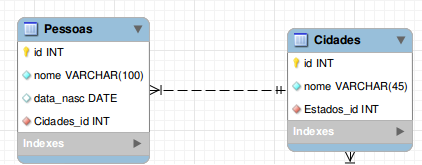

Por mais que existam características diferentes entre os softwares de modelagem, o princípio de elaboração do modelo é o mesmo e deve ser seguido.

### **Modelo de dados físico do Clube do Livro:**

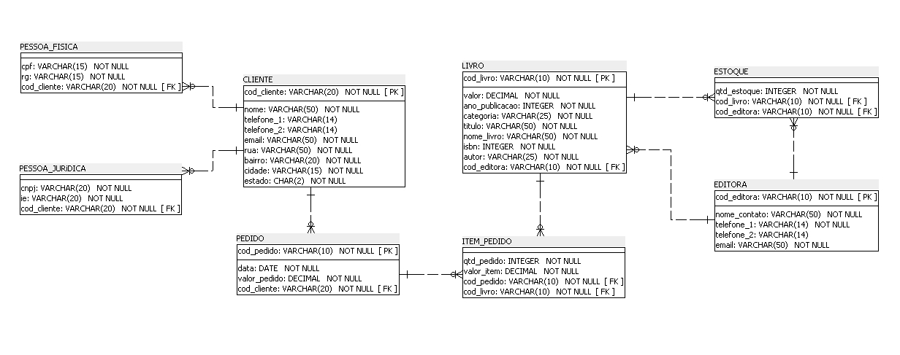

O modelo físico elaborado no curso pode ser acessado baixando o arquivo [modelagem_fisica](modelagem_fisica.architect).

⬆️ [Voltar ao topo](#modelagem-de-banco-de-dados-relacional-modelagem-lógica-e-física) ⬆️
